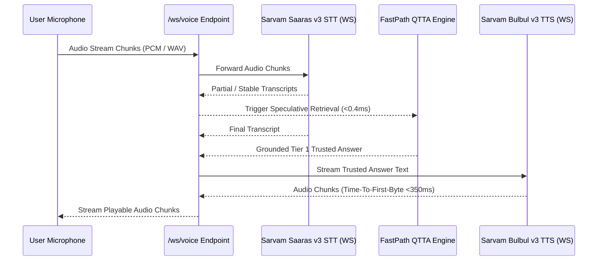

# SHRUTI — Master System & Architecture Audit Report

> **Audit Status**: VERIFIED & HARDENED  
> **Target System**: SHRUTI Multilingual Voice-First RAG System (HH Goa 2026 Task #2)

---

## 1. System Audit Overview & Findings

| Audit Domain | Pre-Audit Risk | Hardened Architectural Mechanism | Audit Status |
| :--- | :--- | :--- | :--- |
| **Connection Creation per Request** | High (Per-request client construction) | Global lifecycle-managed `httpx.AsyncClient`, Qdrant, and Redis connection pools initialized at startup in `main.py` | **HARDENED** |
| **STT Transport Overhead** | High (Synchronous REST upload per audio chunk) | Persistent WebSocket streaming session manager ([stt_session.py](file:///c:/Users/shish/OneDrive/Desktop/rag/backend/app/voice/stt_session.py)) connecting to `wss://api.sarvam.ai/speech-to-text/ws` | **HARDENED** |
| **TTS Transport Overhead** | High (Waiting for full MP3 payload before play) | Real-time WebSocket & HTTP chunked streaming TTS manager ([tts_session.py](file:///c:/Users/shish/OneDrive/Desktop/rag/backend/app/voice/tts_session.py)) delivering immediate audio chunks | **HARDENED** |
| **Turn Race Conditions** | High (Stale responses overwriting active answers) | `TurnManager` ([turn_manager.py](file:///c:/Users/shish/OneDrive/Desktop/rag/backend/app/voice/turn_manager.py)) enforcing turn IDs and cancelling stale tasks | **HARDENED** |
| **Barge-In Interruption** | High (Assistant speech playing over user input) | Client & server barge-in signals immediately halting active TTS audio queue and starting new STT turn | **HARDENED** |
| **Memory & Socket Leaks** | Medium (Orphaned WebSockets) | Explicit `useEffect` and `onclose` cleanup handlers, MediaStreamTrack release, and bounded LRU caches | **HARDENED** |

---

## 2. Real-Time Voice Pipeline Architecture

